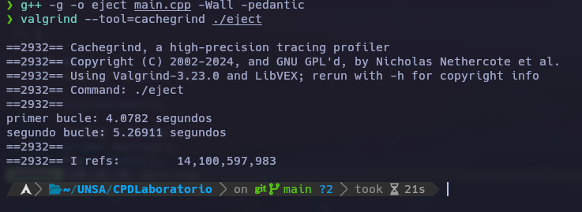
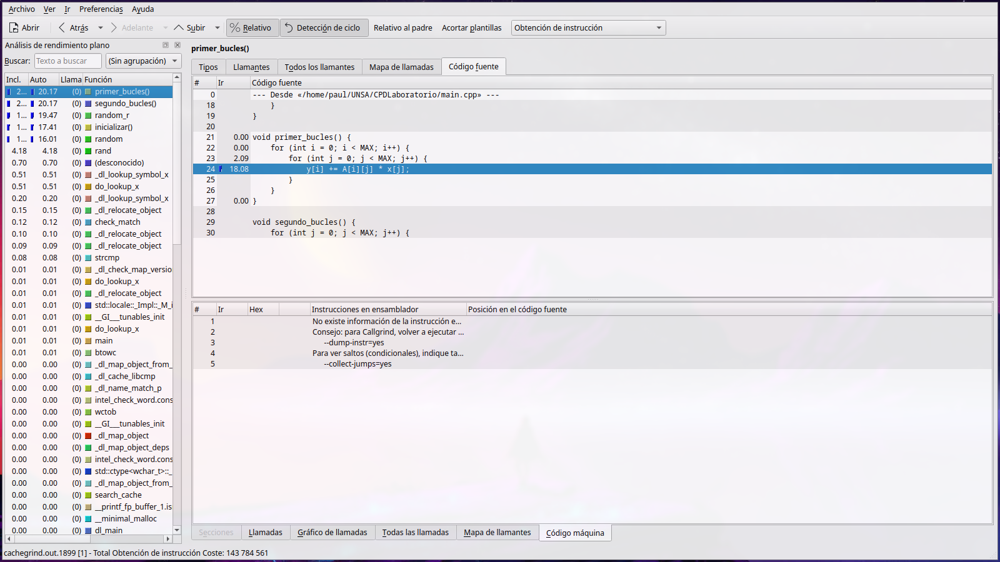

### Ejercicio 1:

1. **Primer bucle**:
   - Accede a la matriz `A` en **orden fila por fila**. En C, las matrices se almacenan en **row-major order** (primero se almacenan los elementos de la fila 0, luego de la fila 1, etc.).
   - Por lo tanto, los elementos de `A[i][j]` en la primera versión del bucle son accesados en bloques contiguos en memoria. Esto mejora el rendimiento debido a la **localidad espacial**, ya que varios elementos de una misma fila pueden ser cargados en una sola línea de caché.
   - En este caso, se espera que haya menos **fallos de caché**, lo que aumenta la eficiencia del programa.

2. **Segundo bucle**:
   - En esta versión, el orden de los bucles se invierte, lo que hace que los elementos de la matriz se accedan en orden columna por columna.
   - Como resultado, los accesos a `A[i][j]` están más dispersos en la memoria. Esto provoca que la caché tenga que cargar líneas de memoria con frecuencia, causando **más fallos de caché**.
   - En este caso, la **localidad espacial** se pierde, lo que resulta en un rendimiento significativamente peor.

- La **caché** del procesador guarda los datos en bloques llamados **líneas de caché**. En nuestro caso, estamos accediendo a una matriz bidimensional almacenada en **row-major order** (cada fila se almacena contiguamente en la memoria).
- En el primer bucle, se accede a los elementos de la matriz en secuencia, lo que significa que una sola línea de caché puede contener múltiples elementos seguidos, resultando en menos **fallos de caché**.
- En el segundo bucle, se accede a los elementos de forma dispersa (columna por columna), lo que genera **más fallos de caché** porque cada vez que accedemos a un nuevo elemento en otra columna, la caché tiene que reemplazar datos, lo que ralentiza el programa.
- Considerando el tiempo de ejecucion el primer bucle es mejor casi en la mitad de tiempo del segundo bucle.

## Pruebas con valgrid

## Pruebas con kcachegrind

