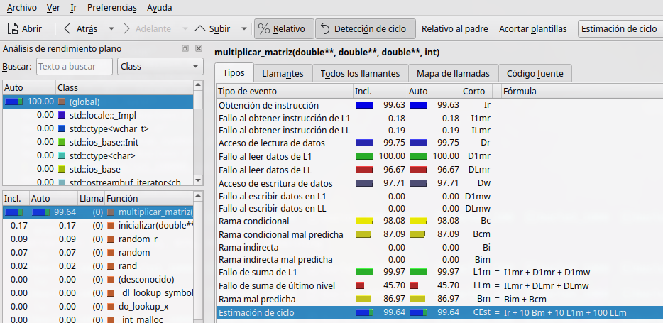
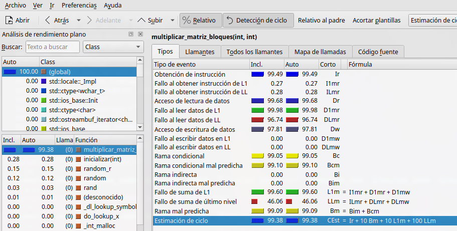

Aquí tienes un ejemplo de cómo deberías estructurar un archivo `README.md` para tu proyecto, con las imágenes incluidas y la referencia a los archivos en el directorio `captures/`. El texto sigue el formato que usaste en LaTeX.

```markdown
# Laboratorio 01 - Computación Paralela y Distribuida

Este repositorio contiene el código y los análisis del Laboratorio 01 de la materia de **Computación Paralela y Distribuida**. A continuación, se detallan las implementaciones, los objetivos, y los análisis realizados.

## Tabla de Contenidos
1. [Introducción](#introducción)
2. [Objetivos](#objetivos)
3. [Desarrollo](#desarrollo)
    - [Implementación de los bucles anidados FOR](#implementación-de-los-bucles-anidados-for)
    - [Multiplicación de matrices clásica](#multiplicación-de-matrices-clásica)
    - [Multiplicación de matrices por bloques](#multiplicación-de-matrices-por-bloques)
4. [Conclusiones](#conclusiones)

## Introducción
En este trabajo se comparan dos enfoques de algoritmos para la manipulación de matrices. Primero, se implementaron dos bucles anidados que realizan la operación de multiplicación de matrices secuencialmente. Luego, se implementan el algoritmo clásico de multiplicación de matrices (tres bucles) y la multiplicación por bloques.

Además, se utilizaron herramientas como **Valgrind** y **KCachegrind** para analizar la eficiencia en el uso de la memoria caché y el tiempo de ejecución de cada enfoque.

El código fuente está disponible en [este repositorio de GitHub](https://github.com/PaulParizacaMozo/CPDLaboratorio/tree/main/Laboratorio01).

## Objetivos
- Implementar y comparar dos bucles anidados para la multiplicación de matrices.
- Implementar en C/C++ la multiplicación de matrices clásica (tres bucles anidados).
- Implementar la multiplicación de matrices por bloques y comparar su desempeño con el enfoque clásico.
- Evaluar ambos algoritmos usando herramientas como **Valgrind** y **KCachegrind**.

## Desarrollo

### Implementación de los bucles anidados FOR
En esta sección, se implementaron y evaluaron dos bucles anidados con tamaños de matrices de 100, 1000 y 10000. Los resultados en términos de tiempo de ejecución y uso de memoria caché se muestran a continuación.

```cpp
// Primer bucle anidado
void primer_bucles() {
    for (int i = 0; i < MAX; i++) {
        for (int j = 0; j < MAX; j++) {
            y[i] += A[i][j] * x[j];
        }
    }
}
```

```cpp
// Segundo bucle anidado
void segundo_bucles() {
    for (int j = 0; j < MAX; j++) {
        for (int i = 0; i < MAX; i++) {
            y[i] += A[i][j] * x[j];
        }
    }
}
```

### Resultados
- **Primer bucle:** Tiene un mejor rendimiento gracias a su acceso secuencial a las filas de la matriz, optimizando el uso de la caché. 
- **Segundo bucle:** Accede a columnas, lo que provoca más fallos de caché.

### Resultados de Valgrind y KCachegrind:


### Multiplicación de matrices clásica
La implementación de la multiplicación de matrices clásica sigue el siguiente código:

```cpp
for (int i = 0; i < N; i++) {
    for (int j = 0; j < N; j++) {
        for (int k = 0; k < N; k++) {
            C[i][j] += A[i][k] * B[k][j];
        }
    }
}
```

### Resultados de Valgrind:



### Multiplicación de matrices por bloques
La multiplicación por bloques optimiza el acceso a la memoria caché, utilizando un tamaño de bloque de 64 bytes, lo que es ideal para arquitecturas modernas como el procesador Intel Core i7-9850H.

### Resultados de Valgrind y KCachegrind:



## Conclusiones
Se concluye que el algoritmo de multiplicación por bloques es más eficiente en cuanto al uso de la caché y el tiempo de ejecución, en comparación con el algoritmo clásico de tres bucles. Las pruebas realizadas con Valgrind y KCachegrind confirman que un acceso optimizado a la memoria es crucial para mejorar el rendimiento en sistemas modernos.

## Referencias
1. P. Pacheco, *An Introduction to Parallel Programming*, 1st ed., Morgan Kaufmann, 2011.
2. B. Wicht, "How to profile C++ applications with Callgrind and KCachegrind", 2011. 
3. Purdue University, "Optimizing Matrix Multiplication", 2023. Available: [https://www.cs.purdue.edu/homes/grr/cs250/lab6-cache/optimizingMatrixMultiplication.pdf](https://www.cs.purdue.edu/homes/grr/cs250/lab6-cache/optimizingMatrixMultiplication.pdf)
4. Valgrind User Manual, 2023. Available: [http://valgrind.org/docs/manual/manual.html](http://valgrind.org/docs/manual/manual.html)
```

Este archivo `README.md` sigue el mismo formato que el documento en LaTeX, con las imágenes correctamente referenciadas y las citas en formato IEEE incluidas al final.
