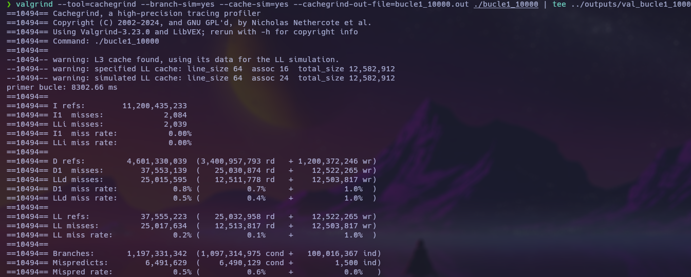
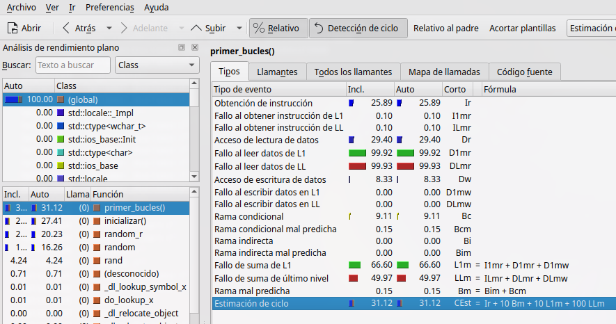
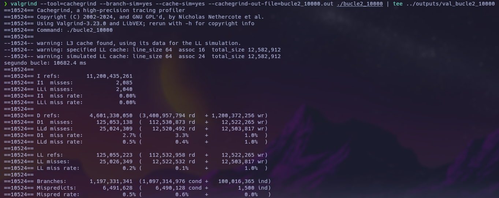
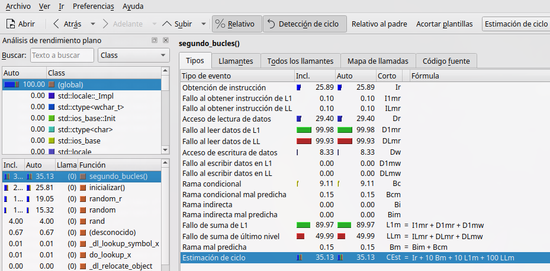
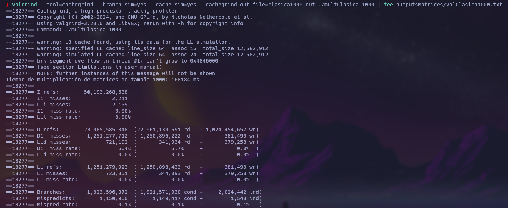
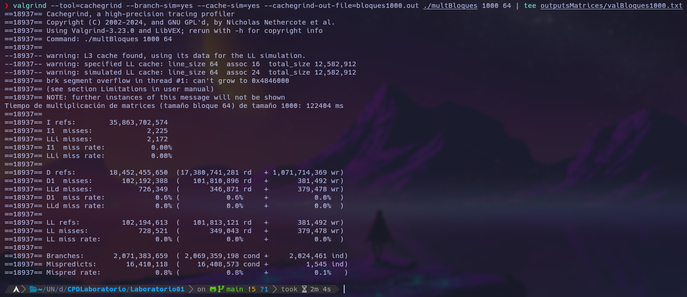

# Laboratorio 01 - Computación Paralela y Distribuida

## Autor
- Paul Antony Parizaca Mozo

## Descripción

El trabajo tiene como objetivo implementar y comparar dos enfoques de algoritmos para la multiplicación de matrices. El primer ejercicio analiza dos bucles anidados que realizan operaciones de multiplicación de matrices, mientras que en el segundo se comparan el algoritmo clásico de tres bucles anidados con un algoritmo optimizado que utiliza bloques. 

### Herramientas utilizadas:
- [Valgrind](https://valgrind.org/)
- [KCachegrind](https://kcachegrind.sourceforge.net/)

## Objetivos

- Implementar y comparar los dos bucles anidados del capítulo 2.
- Implementar la multiplicación de matrices clásica (tres bucles anidados).
- Implementar la versión optimizada por bloques (seis bucles anidados).
- Evaluar el movimiento de datos entre la memoria principal y la memoria caché.
- Analizar el rendimiento con herramientas como Valgrind y KCachegrind.

## Implementación

### Bucle Anidado 1

```cpp
void primer_bucles() {
    for (int i = 0; i < MAX; i++) {
        for (int j = 0; j < MAX; j++) {
            y[i] += A[i][j] * x[j];
        }
    }
}
```

### Bucle Anidado 2

```cpp
void segundo_bucles() {
    for (int j = 0; j < MAX; j++) {
        for (int i = 0; i < MAX; i++) {
            y[i] += A[i][j] * x[j];
        }
    }
}
```

Ambos bucles se evaluaron con matrices de tamaños 100, 1000 y 10000. El primer bucle resultó ser más eficiente en términos de uso de la caché y tiempo de ejecución, especialmente para matrices grandes. 

### Resultados del tiempo de ejecución:

| Tamaño de la matriz | Primer Bucle (ms) | Segundo Bucle (ms) |
|---------------------|-------------------|--------------------|
| 100                 | 0.044203          | 0.024588           |
| 1000                | 2.2674            | 2.68919            |
| 10000               | 232.296           | 412.86             |

## Análisis de Memoria Caché

El análisis se realizó utilizando Valgrind y KCachegrind, mostrando cómo el primer bucle, que accede a las filas secuencialmente, aprovecha mejor la localidad espacial en la memoria, minimizando los fallos de caché. Por el contrario, el segundo bucle tiene un acceso a columnas, lo que resulta en más fallos de caché y un mayor tiempo de ejecución.

### Análisis de Valgrind del Primer Bucle:



### Análisis de KCachegrind del Primer Bucle:



Resultados clave:
- Tasa de fallos en caché de datos (D1 miss rate): 0.8%
- Tiempo de ejecución: 8302.66 ms

### Análisis de Valgrind del Segundo Bucle:



### Análisis de KCachegrind del Segundo Bucle:



Resultados clave:
- Tasa de fallos en caché de datos (D1 miss rate): 2.7%
- Tiempo de ejecución: 10682.4 ms

## Multiplicación de Matrices Clásica

El siguiente paso fue la implementación del algoritmo clásico de multiplicación de matrices con tres bucles anidados.

```cpp
void multiplicar_matriz(double **A, double **B, double **C, int N) {
    for (int i = 0; i < N; i++) {
        for (int j = 0; j < N; j++) {
            for (int k = 0; k < N; k++) {
                C[i][j] += A[i][k] * B[k][j];
            }
        }
    }
}
```

### Resultados del tiempo de ejecución:

| Tamaño de la matriz | Tiempo de ejecución (ms) |
|---------------------|--------------------------|
| 100                 | 18.5484                  |
| 500                 | 539.149                  |
| 1000                | 5573.34                  |
| 2000                | 79860.9                  |

## Multiplicación de Matrices por Bloques

En este enfoque, la multiplicación de matrices se realiza utilizando bloques para mejorar el uso de la caché. Se probaron varios tamaños de bloque (32, 64), y el mejor rendimiento se logró con bloques de 64.

```cpp
void multiplicar_matriz_bloques(int tamaño, int tamaño_bloque) {
    for (int i = 0; i < tamaño; i += tamaño_bloque) {
        for (int j = 0; j < tamaño; j += tamaño_bloque) {
            for (int k = 0; k < tamaño; k += tamaño_bloque) {
                for (int bi = i; bi < i + tamaño_bloque && bi < tamaño; ++bi) {
                    for (int bj = j; bj < j + tamaño_bloque && bj < tamaño; ++bj) {
                        double suma = 0;
                        for (int bk = k; bk < k + tamaño_bloque && bk < tamaño; ++bk) {
                            suma += A[bi][bk] * B[bk][bj];
                        }
                        C[bi][bj] += suma;
                    }
                }
            }
        }
    }
}
```

### Resultados del tiempo de ejecución:

| Tamaño de la matriz | Tiempo (Bloque 64) (ms) |
|---------------------|-------------------------|
| 100                 | 14.5432                 |
| 500                 | 357.247                 |
| 1000                | 2884.16                 |
| 2000                | 23176.2                 |

## Comparación de Algoritmos

### Algoritmo Clásico vs Multiplicación por Bloques

Al comparar ambos algoritmos, la multiplicación por bloques resultó ser más eficiente, reduciendo significativamente el tiempo de ejecución y el número de fallos de caché, lo que demuestra la importancia de optimizar el uso de la memoria.

| Algoritmo | Tiempo (ms) | D1 Misses | D1 Miss Rate |
|-----------|-------------|-----------|--------------|
| Clásico   | 168184      | 1,251,277,712 | 5.4% |
| Bloques   | 122404      | 102,192,388   | 0.6% |

### Análisis de Valgrind y KCachegrind:

#### Algoritmo Clásico:



#### Algoritmo por Bloques:



## Conclusiones

1. **Primer ejercicio:** El primer bucle anidado demostró ser más eficiente que el segundo debido a su acceso secuencial a la memoria, lo que optimiza el uso de la caché.
2. **Multiplicación de matrices:** La versión por bloques es más eficiente que la clásica, especialmente para matrices grandes, ya que minimiza los fallos de caché y reduce el tiempo de ejecución.
3. **Eficiencia del uso de la caché:** La organización de los datos en bloques permite aprovechar mejor la jerarquía de memoria, manteniendo los datos dentro de la caché durante la mayor parte de la ejecución.

